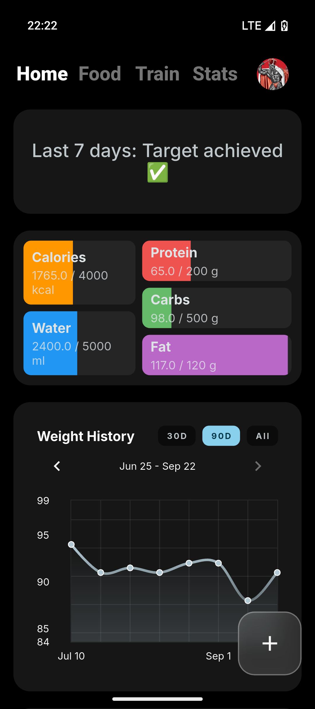
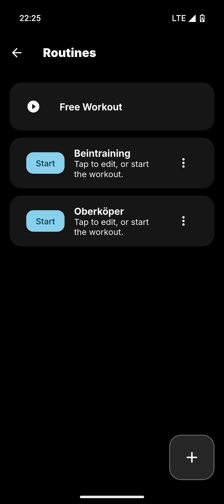
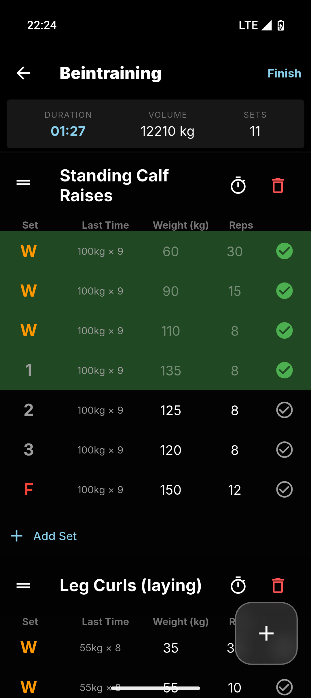
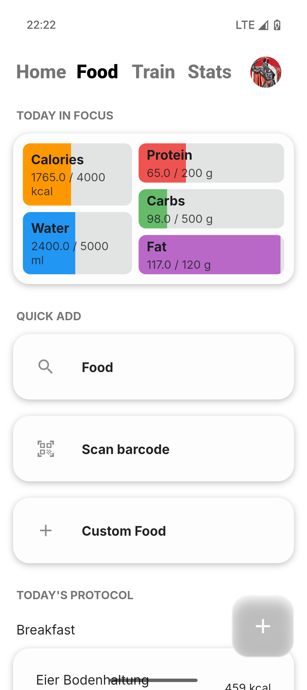
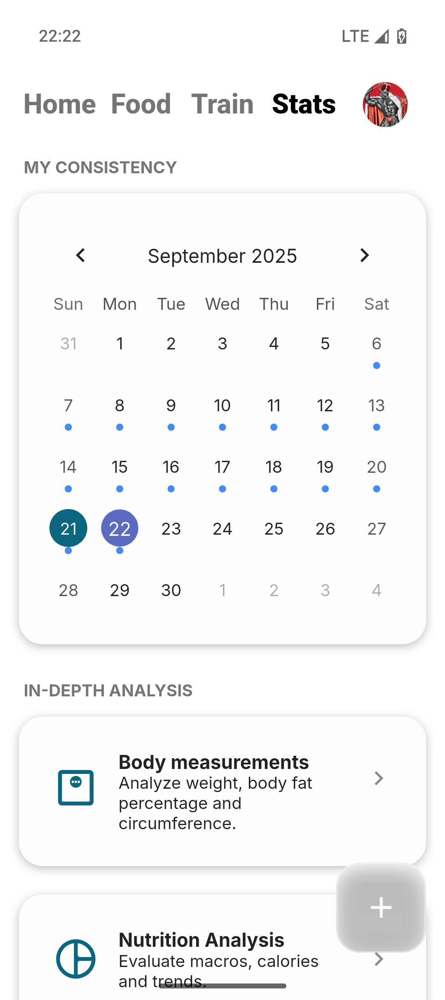
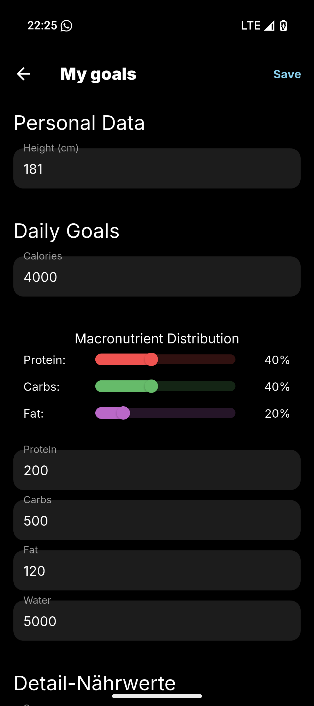

# Lightweight - Your Offline-First Fitness Tracker

  <strong>A modern, privacy-first fitness and nutrition tracking app. Offline-first, no cloud dependency, built with Flutter.</strong>

  
  

---

## ✨ Features

| | |
| :--- | :--- |
| 📊 **Modern Dashboard** | A central hub showing your daily calories, macros, water intake, and weight trend. |
| 🥗 **Advanced Nutrition Tracking** | Log meals via barcode scanner, a vast offline food database, or by creating custom food items. |
| 💪 **Robust Workout Planner & Tracker** | Build detailed workout routines with various set types (Normal, Warmup, Dropset, Failure) and track your sessions live. **Your progress is now saved even if you close the app!** |
| 📅 **Consistency Calendar** | A beautiful heatmap calendar that visualizes your logged workout and nutrition days to keep you motivated. |
| 🎯 **Intuitive Goal Setting** | Set your targets for calories, body measurements, and macronutrients using either direct gram input or a percentage-based calculator. |
| 📦 **Full Data Control** | Your data stays on your device. Import your history from other apps (e.g., Hevy) and export all your data anytime as an unencrypted JSON backup or CSV files. |

## 📸 Screenshots

*Screenshots from v0.2.0 showing both light and dark mode.*

| Home (Dark) | Routines (Dark) | Live Workout (Dark) |
| :---: | :---: | :---: |
|  |  |  |
| **Food (Light)** | **Stats (Light)** | **Goals (Dark)** |
|  |  |  |

## 🚀 Philosophy & Core Principles

-   🔒 **Offline-First & Privacy:** Your health data belongs to you. Everything is stored locally. No registration, no cloud, no tracking.
-   🎨 **Modern & Adaptive Design:** The UI adapts to your system's theme and uses a clean, modern design language.
-   💸 **Free, Open & No Ads:** The core of the app will always be free and open-source.
-   🚀 **Powerful & Intuitive:** A simple surface that hides powerful features.

---

## 🛠️ Technical Architecture

-   **State Management:** `StatefulWidget` and `setState` for local state, with simple singleton services (`WorkoutSessionManager`, `ProfileService`) for global UI state.
-   **Database System (`sqflite`):** A unique three-database system ensures clean data separation (Food Products, Exercises, User Data).

---

## 🤝 Contributing

Feedback, bug reports, and pull requests are warmly welcome! Please check the [open issues](https://github.com/rfivesix/lightweight/issues) to see what's next.

---

## 📄 License & Acknowledgements

The source code is licensed under the **[MIT License](LICENSE)**.

This project relies on the amazing work of these open-data communities:
-   **[Open Food Facts](https://de.openfoodfacts.org/)**: Food product database, licensed under ODbL.
-   **[wger Workout Manager](https://wger.de/)**: Exercise database and API, licensed under CC-BY-SA 3.0.